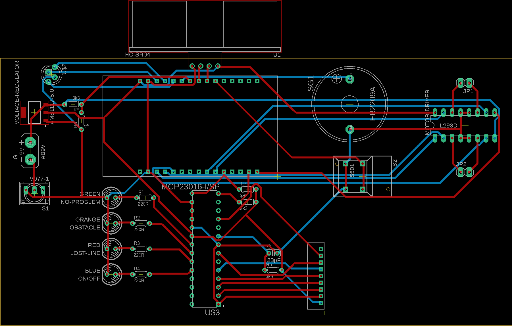

# Autonomous line-following car for Mercedes Benz

- [Autonomous line-following car for Mercedes Benz](#autonomous-line-following-car-for-mercedes-benz)
  - [Intro](#intro)
  - [Components](#components)
  - [Body Plate](#body-plate)
  - [The Schematic \& PCB](#the-schematic--pcb)
  - [The Code](#the-code)
    - [Without MQTT](#without-mqtt)
      - [MCP23016 I/O Expander](#mcp23016-io-expander)
      - [Status Leds](#status-leds)
      - [Sensors](#sensors)
      - [Sensor State Handling](#sensor-state-handling)
      - [Motor Controls](#motor-controls)
      - [Distance Sensor](#distance-sensor)
      - [Battery Voltage](#battery-voltage)
      - [Startup-Tune](#startup-tune)
    - [With MQTT](#with-mqtt)
      - [MQTT](#mqtt)
      - [InfluxDB](#influxdb)
      - [Grafana](#grafana)

<!--
<br>
<br>
<br>
<br>
<br>
<br>
<br>
<br>
<br>
<br>
<br>
<br>
<br>
<br>
<br>
<br>
<br>
<br>
<br>
<br>
<br>
<br>
-->

## Intro
In this project I will make an autonomous line-tracking car. The car is a prototype for the Mercedes Benz museum. Once done, the car will be able to perform the following actions:
1. Follow a white line
2. Detect obstacles in it's way using a HC-SR04 sensor
3. Detect if it has collided with anything
4. Show the battery voltage through a RGB-led indicator
5. Show the status of the vehicle through 4 different leds
6. It'll have a startup-tune
7. Web interface (grafana)
8. It'll also be able to stop at a traversal line at which point it either starts driving after 5sec or after the pressing of a button

## Components
1. ESP-32
2. 1 5xTCRT5000 IR sensor with Limit Switch
3. 2 5V Motor
4. 1 L293d Motor Driver
5. 1 LM 1117 T5,0 Voltage Regulator
6. 2 9V Batteries
7. 1 Switch
8. 1 DC-female jack
9. 1 RGB-led
10. 1 MCP23016 I/O Expander
11. 1 HC-SR04 Ultrasone Sensor
12. 4 leds (green, orange, red, blue) 
13. 1 Button
14. 1 Buzzer
15. 1 Castor Wheel
16. Wires

<!--
<br>
<br>
<br>
<br>
<br>
<br>
<br>
<br>
<br>
<br>
<br>
<br>
<br>
-->

## Body Plate

## The Schematic & PCB
The Schematic (.sch eagle file) can be found in the [./PCB&Schematic/](./PCB%26Schematic/) Folder

An Image of the PCB and the gerber files can also be found there.


<!--
<br>
<br>
<br>
<br>
<br>
<br>
<br>
<br>
<br>
<br>
<br>
<br>
<br>
<br>
<br>
<br>
<br>
<br>
<br>
<br>
<br>
<br>
<br>
<br>
-->

## The Code
### Without MQTT
The full .ino codefile can be found under [./Arduino/Final](./Arduino/Final/Final.ino).
This code has a couple different elements/sensors and I will be explaining the full code per element.
#### MCP23016 I/O Expander
##### Pre-Setup
In the pre-setup we are including the library that is necesary to use the MCP23016. This code also changes the call of the MCP23016 to just MCP which saves space on the microcontroller and makes writing the code easier. We also define the port A (0.0-0.7) and port B (0.1-0.7) data register addresses so that the sketch can interact with both registers. And at last we declare some initial variables of the library that it will need.
```
//------MCP23016------
#include <MCP23016.h>

MCP23016 MCP;

#define GPA 0x00  //port A data register address
#define GPB 0x01  //port B data register address

uint8_t mcpA;  //internal variable of the library - required to be declared as is
uint8_t mcpB;  //internal variable of the library - required to be declared as is

```
##### Setup
In the setup we initialise the expander library with it's I2C address (0x20) and we also initialise Wire for the I2C connection. We also define the pinmodes of all the connected sensors (INPUT) and leds (OUTPUT).
```
  //------MCP23016 I/O Expander------
  Wire.begin();
  Wire.setClock(100000);

  MCP.init(0x20);

  MCP.pinMode(lineSensorLL, INPUT);
  MCP.pinMode(lineSensorL, INPUT);
  MCP.pinMode(lineSensorC, INPUT);
  MCP.pinMode(lineSensorR, INPUT);
  MCP.pinMode(lineSensorRR, INPUT);

  MCP.pinMode(collisionSensor, INPUT);

  MCP.pinMode(problem, OUTPUT);
  MCP.pinMode(obstacle, OUTPUT);
  MCP.pinMode(line, OUTPUT);
  MCP.pinMode(onOFF, OUTPUT);
```
##### Loop
Inside of the loop we use the MCP mainly for getting sensor data and changing the status leds state. The majority of this will be explained later in this document but I'll give some examples.
<br>

To put a led on we do:
`MCP.digitalWrite(onOFF, HIGH);`
Here `onOFF` is the led from which we want to change the state and `HIGH` means that we want to put the led on. If we would want to put the led off, then we would use `LOW` here.
<br>

To read a sensor's value we would do:
`MCP.digitalRead(sensor1);`
In which `sensor1` is the sensor we want to read the value from.

#### Status Leds
##### Pre-Setup
In the Pre-setup we define the pins to which the leds are connected. This is to the MCP in which a0-a7 is 0.0-0.7 and b0-b7 is 1.0-1.7.
```
#define problem a0
#define obstacle a1
#define line a2
#define onOFF a3
```
##### Setup
As said in the [MCP23016](#mcp23016-io-expander) setup section I set the pinmodes here. For the code look at the MCP23016 Setup code.
##### Loop
In the loop there is a function that checks for the state of the error code statuses and adjusts the status leds accordingly.
```
  //------Changing the status leds------
  if (value[5] == false && value[6] == false && value[7] == false) {
    MCP.digitalWrite(problem, HIGH);
  } else {
    MCP.digitalWrite(problem, LOW);
  }

  if (value[5] == true || value[7] == true) {
    MCP.digitalWrite(obstacle, HIGH);
  } else {
    MCP.digitalWrite(obstacle, LOW);
  }

  if (value[6] == true) {
    MCP.digitalWrite(line, HIGH);
  } else {
    MCP.digitalWrite(line, LOW);
  }
```
#### Sensors
##### Pre-Setup
Just like the status leds, the IR line sensors are also connected to the MCP. Here the pins for those sensors is defined in the same way as the status leds, check [here](#status-leds) for more information.
```
//------Sensor Definition------
#define lineSensorLL b0
#define lineSensorL b1
#define lineSensorC b2
#define lineSensorR b3
#define lineSensorRR b4

#define collisionSensor b5
```
##### Setup
Just like the status leds in setup, the sensors' pinmode is also getting defined here. More information can be found [here](#mcp23016-io-expander).
##### Loop
In the loop, the sensor values will be read as explained with the [MCP23016-explenation](#mcp23016-io-expander). For the logic behind the reading of the sensor values, take a look [here](#sensor-state-handling).

#### Sensor State Handling
##### Pre-Setup
Before I started to write the sensor state handling, I thought about what I needed and seeing that there are a fair amount of value's that need to be changed I thought that always using a for-loop would be more benefitial. So I did and the following code is what's needed for that.
```
int sensors[6] = { lineSensorLL, lineSensorL, lineSensorC, lineSensorR, lineSensorRR, collisionSensor };

String sensornames[8] = { "LL", "L", "C", "R", "RR", "Col", "Line", "Dist" };

bool value[8] = { false, false, false, false, false, false, false, false };

bool middle = false;
bool left = false;
bool right = false;
```
I first define the line sensors here. This is so that I can reference them by index and not always have to change them individually. After that I added an array of string to also reference the abbreviated names of the values by index which is very beneficial for printing the values sincce you can just use 1 for loop.
After that I put the values of the sensors in a boolean array.
The last 3 booleans have been added, because the line was way smaller than the gap between the sensors and so the vehicle needed to remember that it just had a line visible at a specified sensor which would help it to correct itself. This will be explained more clearly later on.
##### Setup
In the setup I don't have anything, because there are just values which don't need to be initialised.
##### Loop
The loop has several pieces which are considered in the sensor handling proces.
##### Distance
This is a simple if statement that checks if the current value of the distance sensor is greater than the set trigger distance and adjusts the distance value accordingly.
```
  if (cm < triggerDistance) {
    value[7] = true;
  } else {
    value[7] = false;
  }
```
##### Whiteline
For testing purposes and in order to be versatile, I implemented a simple value that reads the values of the sensors according to the preset mode which can change between following a white line or a black line.
```
  if (whiteLine) {
    //------Sensor data acquisition for a white line----
    for (int i = 0; i < 6; i++) {
      value[i] = MCP.digitalRead(sensors[i]);
    }
  } else {
    //------Sensor data acquisition for a black line----
    for (int i = 0; i < 6; i++) {
      value[i] = !MCP.digitalRead(sensors[i]);
    }
    value[5] = !value[5];
  }
```
##### Debug Printing
I also implemented a simple debug print of the sensor states with a for-loop.
```
  for (int i = 0; i < 8; i++) {
    Serial.print(String(sensornames[i]));
    Serial.print(": ");
    Serial.print(value[i]);
    Serial.print(" | ");
  }
  Serial.println();
```
#### Motor Controls
##### Pre-Setup
In the pre-setup we define the motor pins, the speed of the motors and some variables to controll the halting of the vehicle at a traverse line.
##### Motor Pins
This vehicle has 2 5V DC motors called M1 and M2. Each of these motors are connected to the motor driver which has 3 inputs called EN, F and R. EN is short for Enable, which turns the engines on or off. F is short for Forward which makes the motor spin forward relative to the vehicle. R is short for Reverse which makes the motor spin in reverse relative to the vehicle.
```
#define M1_EN 15
#define M1_F 2
#define M1_R 4

#define M2_EN 23
#define M2_F 18
#define M2_R 19
```
##### Motor Speed
The motor speed is changed using PWM. In this case of the motor direction should not spin, then the value would be `low` of 0 and if the motor direction should spin, then the value would be `high` or 120.
```
#define high 120
#define low 0
```
##### Halt Control
For the vehicle to be able to take halt at a traverse line, we need to have a couple different values. First of all we need a state value to check if the vehicle is in halt. Then we need some variables to control the time that the vehicle should halt. At last we add a button to be able to skip the halting and move forward straight away.
```
bool haltControl = true;
int haltLast = 0;
int elapsedHalt = 0;
int currentHalt = 0;

#define haltButton 32
```
##### Setup
In the setup we only need to add the correct pin modes to the motor pins and to the halt button.
```
  //------Motor pins------
  pinMode(M1_EN, OUTPUT);
  pinMode(M1_F, OUTPUT);
  pinMode(M1_R, OUTPUT);

  pinMode(M2_EN, OUTPUT);
  pinMode(M2_F, OUTPUT);
  pinMode(M2_R, OUTPUT);
  
  //------Halt Button------
  pinMode(haltButton, INPUT_PULLUP);
```
##### Loop
In the loop we control the behavior of the car so that it follows the line. This has several if/else if/else statements which will be explained one by one hereunder.
##### Stand still at obstacle
When the vehicle detects an obstacle either through it's distance sensor or through it's collision sensor, then all motors will be shut down.
```
  //------Stand still at obstacle------
  if (value[5] == HIGH || value[7] == HIGH) {
    digitalWrite(M1_EN, LOW);
    analogWrite(M1_F, low);
    analogWrite(M1_R, low);
    digitalWrite(M2_EN, LOW);
    analogWrite(M2_F, low);
    analogWrite(M2_R, low);
    middle = false;
    left = false;
    right = false;
    value[6] = false;
  }
```
##### Travese white line control
The following code checks to see if there is a traverse white line which signals a holding point. It checks first to see if all line sensors' values are the line color's value. After that we stop the motors. Then we change the haltControl variable to signal that a halt point has geen reached and we start the timer. Then either after 5 seconds or after the press of the continue button, the car drives forward for 200ms which should be enough to clear the holding point line. 
```
  //------Traverse White line control------
  else if (((value[1] == HIGH) && (value[2] == HIGH) && (value[3] == HIGH) && (value[5] == LOW) && (value[7] == LOW)) || haltControl == false) {
    digitalWrite(M1_EN, LOW);
    analogWrite(M1_F, low);
    analogWrite(M1_R, low);
    digitalWrite(M2_EN, LOW);
    analogWrite(M2_F, low);
    analogWrite(M2_R, low);
    Serial.println("Halt point reached");
    if (haltControl) {
      haltControl = false;
      haltLast = millis();
    }
    currentHalt = millis();
    if (((currentHalt - haltLast) >= 5000) || digitalRead(haltButton) == LOW) {
      currentHalt = haltLast + 5500;
      haltControl = true;
      digitalWrite(M1_EN, HIGH);
      analogWrite(M1_F, high);
      analogWrite(M1_R, low);
      digitalWrite(M2_EN, HIGH);
      analogWrite(M2_F, high);
      analogWrite(M2_R, low);
      delay(200);
    }
    middle = false;
    left = false;
    right = false;
    value[6] = false;
  }
```
##### Line Following: Center White
In this statement we check to see if the most center sensor is the color of the line. If so, then we can just have both motors drive forward. In addition to this, we set the middle variable to true, to signal that the last sensor was the middle one and we set index 6 of the value array to false, which tells us that the vehicle has not lost the line.
```
  //------Line following: center white------
  else if ((value[1] == LOW) && (value[2] == HIGH) && (value[3] == LOW) && (value[5] == LOW) && (value[7] == LOW)) {
    digitalWrite(M1_EN, HIGH);
    analogWrite(M1_F, high);
    analogWrite(M1_R, low);
    digitalWrite(M2_EN, HIGH);
    analogWrite(M2_F, high);
    analogWrite(M2_R, low);
    middle = true;
    left = false;
    right = false;
    value[6] = false;
  }
```
##### Line Following: Left White
In this statement we check to see if the left sensor is the color of the line. If so, then we set the left motor (M1) to drive forward and the right motor (M2) to drive backwards. We do this alternate motor movement to make our turning smaller and so to have less problems related to that. In addition to this, we set the left variable to true, to signal that the last sensor was the left one and we set index 6 of the value array to false, which tells us that the vehicle has not lost the line.
```
  //------Line following: Left white------
  else if ((value[1] == HIGH) && (value[2] == LOW) && (value[3] == LOW) && (value[5] == LOW) && (value[7] == LOW)) {
    digitalWrite(M1_EN, HIGH);
    analogWrite(M1_F, high);
    analogWrite(M1_R, low);
    digitalWrite(M2_EN, HIGH);
    analogWrite(M2_F, low);
    analogWrite(M2_R, high);
    middle = false;
    left = true;
    right = false;
    value[6] = false;
  }
```
##### Line Following: Right White
In this statement we check to see if the right sensor is the color of the line. If so, then we set the left motor (M1) to drive backwards and the right motor (M2) to drive forwards. We do this alternate motor movement to make our turning smaller and so to have less problems related to that. In addition to this, we set the right variable to true, to signal that the last sensor was the right one and we set index 6 of the value array to false, which tells us that the vehicle has not lost the line.
```
  //------Line following: Right white------
  else if ((value[1] == LOW) && (value[2] == LOW) && (value[3] == HIGH) && (value[5] == LOW) && (value[7] == LOW)) {
    digitalWrite(M1_EN, HIGH);
    analogWrite(M1_F, low);
    analogWrite(M1_R, high);
    digitalWrite(M2_EN, HIGH);
    analogWrite(M2_F, high);
    analogWrite(M2_R, low);
    middle = false;
    left = false;
    right = true;
    value[6] = false;
  }
```
##### Line Lost Check
In this else if statement we check to se if the vehicle has lost the line. If the vehicle has not lost the line, then this statement will be skipped. Otherwise it will first check which sensor was the last one. If the last sensor was the middle one, then we just keep driving forward. If the last sensor was the left one, then we turn to the left. If the last sensor was the right one, then we turn to the right. If the last sensor was not the middle one nor the left nor the right one, then classify the vehicle as lost. At which point we change index 6 of the value array to true which lets the operators know that the vehicle is lost. This statement basically extends the range of the sensors to a little outside of their measuring capability.
```
  //------Line lost check------
  else if ((value[1] == LOW) && (value[2] == LOW) && (value[3] == LOW) && (value[5] == LOW) && (value[7] == LOW)) {
    if (middle == true) {
      digitalWrite(M1_EN, HIGH);
      analogWrite(M1_F, high);
      analogWrite(M1_R, low);
      digitalWrite(M2_EN, HIGH);
      analogWrite(M2_F, high);
      analogWrite(M2_R, low);
    } else if (left == true) {
      digitalWrite(M1_EN, HIGH);
      analogWrite(M1_F, low);
      analogWrite(M1_R, high);
      digitalWrite(M2_EN, HIGH);
      analogWrite(M2_F, high);
      analogWrite(M2_R, low);
    } else if (right == true) {
      digitalWrite(M1_EN, HIGH);
      analogWrite(M1_F, high);
      analogWrite(M1_R, low);
      digitalWrite(M2_EN, HIGH);
      analogWrite(M2_F, low);
      analogWrite(M2_R, high);
    } else {
      digitalWrite(M1_EN, LOW);
      analogWrite(M1_F, low);
      analogWrite(M1_R, low);
      digitalWrite(M2_EN, LOW);
      analogWrite(M2_F, low);
      analogWrite(M2_R, low);
      middle = false;
      left = false;
      right = false;
      value[6] = true;
      Serial.println("Lost the line");
    }
  }
```
##### Unforseen state
If all the previous statements are no applicable, then there must be something wrong with the vehicle or its sensor and so the print an error which will let the operators know that there is a problem.
```
  //------Unforeseen state------
  else {
    Serial.println("ERROR");
    value[6] = false;
  }
```
#### Distance Sensor
##### Pre-Setup
In the pre-setup we have to declare the pins to which the trigger and echo pins are connected. We also initialise some values to measure the duration of the pulse and the distance of the nearest object and we also specify the distance at which the vehicle should stop for an object.
```
//-----Distance Sensor-----
#define trigPin 33
#define echoPin 25
long duration, cm;
int triggerDistance = 10;
```
##### Setup
In the setup we just have to change the pinmodes of the trigger and echo pin to the correct mode.
```
  //-----Distance Sensor Configuration-----
  pinMode(trigPin, OUTPUT);
  pinMode(echoPin, INPUT);
```
##### Loop
To measure the distance I made a seperate function, so in the loop I only placed the call for that function to be ran and a print to be able to see the distance to the nearest object on the serial monitor.
```
  distanceCalc();
  Serial.println("Dist: " + String(cm) + " cm");
```
The seperate function first makes sure that the trigger pin is not activater, then waits for 5 microseconds. After that it triggers the triggerpin for 10 microseconds. Afterwhich the pulse-in duration of that trigger pulse is measured on the echopin. Afterwhich we calculate the distance in cm by first halving the time it to for the pulse to reach the receiver, which we have to do because the echo did double the distance. Afterwhich we can multiply the time that it took to reach the object with 0.0343 which is the speed of sound in cm/µs.
```
//------Calculating the distance to the nearest object infront of the sensor------
void distanceCalc() {
  digitalWrite(trigPin, LOW);
  delayMicroseconds(5);
  digitalWrite(trigPin, HIGH);
  delayMicroseconds(10);
  digitalWrite(trigPin, LOW);

  duration = pulseIn(echoPin, HIGH);

  cm = (duration / 2) * 0.0343;
}
```
#### Battery Voltage
##### Pre-Setup
To measure the battery voltage we use a voltage devider, because the esp-32's adc only measures upto 3.3V. For this voltage devider, we used a 1k and 3k3 ohm resistor. So we first have to define the input pin on the esp-32 from which the battery voltage with be measured and calculated. For this we also make a variable to store the actual battery voltage (VBAT) and 2 variables with the measured resistance of the 2 voltage devider resistors. Lastly we define the pins for the rgb led that will display the batteryvoltage.
```
//------Battery Voltage------
#define BAT 26

float VBAT;
float R1 = 3259.0;
float R2 = 983.0;

#define PIN_RED 14
#define PIN_GREEN 13
#define PIN_BLUE 12
```
##### Setup
In the setup we only have to change the pinmodes of the different pins for the battery voltage input and for the rgb led output. Afterwhich we need to turn off the 3 rgb led colors, because otherwise they might already turn on through other factors.
```
  //------VBAT------
  pinMode(BAT, INPUT);

  pinMode(PIN_RED, OUTPUT);
  pinMode(PIN_GREEN, OUTPUT);
  pinMode(PIN_BLUE, OUTPUT);

  analogWrite(PIN_RED, 0);
  analogWrite(PIN_GREEN, 0);
  analogWrite(PIN_BLUE, 0);
```
##### Loop
As with the distancesensor I used a seperate function to calculate the battery voltage. That is why in the loop I only call that function. What I also do in the loop is turn on the correct pin of the rgb led. This code makes sure that when the calculated battery voltage is above or equal to 8V, then only the green led will turn on. If the calculated battery voltage is between 8V and greater or equal to 6V, that only the blue led will turn on and if the voltage is below 6V, then only the red led will turn on.
```
  batteryCheck();

  if (VBAT >= 8) {
    analogWrite(PIN_RED, 0);
    analogWrite(PIN_GREEN, 255);
    analogWrite(PIN_BLUE, 0);
  } else if (VBAT < 8 && VBAT >= 6) {
    analogWrite(PIN_RED, 0);
    analogWrite(PIN_GREEN, 0);
    analogWrite(PIN_BLUE, 255);
  } else if (VBAT < 6) {
    analogWrite(PIN_RED, 255);
    analogWrite(PIN_GREEN, 0);
    analogWrite(PIN_BLUE, 0);
  }
```
The separate function calculates the battery voltage using the formula for a voltage devider. It first calculates the ratio of the measured voltage to the actual voltage, then multiplies this with the Volt/step ratio of the esp-32's adc and then multiplies that with the measured value from the adc through an analogRead of the BATtery. After which a 0.5V correction is added. At this moment the VBAT value is the approximate voltage of the battery. Which will then be used in the code above.
```
//------Checking the battery voltage------
void batteryCheck() {
  VBAT = (((R1 + R2) / R2) * (3.30f / 4095.0f) * analogRead(BAT)) + 0.5f;
  Serial.print("Battery Voltage = ");
  Serial.print(VBAT, 2);
  Serial.println(" V");
}
```
#### Startup-Tune
##### Pre-Setup
For the startup-tune we first have to define the frequency of the different notes that we will use in the song. After which we define the tempo of the song, the pin of the buzzer and the melody, which is an array of notes and the duration of said note. Thereafter we calculate the amount of notes there are in that array, how long a wholenote takes. We also define a divider and a noteduration.
```
//------Startup-Tune------
#define NOTE_CS4 277
#define NOTE_D4 294
#define NOTE_E4 330
#define NOTE_FS4 370
#define NOTE_GS4 415
#define NOTE_A4 440
#define NOTE_B4 494
#define NOTE_CS5 554
#define NOTE_D5 587
#define NOTE_DS5 622
#define NOTE_E5 659
#define REST 0

int tempo = 180;

int buzzer = 27;

int melody[] = {
  NOTE_E5,8,NOTE_D5,8,NOTE_FS4,4,NOTE_GS4,4,
  NOTE_CS5,8,NOTE_B4,8,NOTE_D4,4,NOTE_E4,4,
  NOTE_B4,8,NOTE_A4,8,NOTE_CS4,4,NOTE_E4,4,
  NOTE_A4,2,
};

int notes = sizeof(melody) / sizeof(melody[0]) / 2;

int wholenote = (60000 * 4) / tempo;

int divider = 0, noteDuration = 0;
```
##### Setup
In the setup we play the song. This is done through going through the melody array and playing it with the tone function. This function takes in the buzzer pin, note frequency and noteduration. Afterwhich we wait for the the duration of the not, then the buzzer gets stopped and the next note is played.
```
  //------Startup-Tune-----
  for (int thisNote = 0; thisNote < notes * 2; thisNote = thisNote + 2) {
    divider = melody[thisNote + 1];
    if (divider > 0) {
      noteDuration = (wholenote) / divider;
    } else if (divider < 0) {
      noteDuration = (wholenote) / abs(divider);
      noteDuration *= 1.5;
    }
    tone(buzzer, melody[thisNote], noteDuration * 0.9);
    delay(noteDuration);
    noTone(buzzer);

  }
```
### With MQTT
The full .ino codefile can be found under [./Arduino/Final-MQTT](./Arduino/Final-MQTT/Final-MQTT.ino). Since most of this code is exactly the same as the code without MQTT will I only be explaining the MQTT part here.
#### MQTT
##### Pre-Setup
In the pre-setup we include the libraries for wifi and MQTT. We define the ssid and password for the wifi network we want to connect to, the MQTT server IP address, MQTT port as well as MQTT username and password to login to MQTT, lastly we define the clientID we want our esp-32 to have. After this we setup the libraries for wificonnectivity and MQTT communication. We give this device it's Node_ID and the networks Broadcast ID. Lastly we define some variables that are necessary for the halt function, because we will only be sending data every 50 ms. If you want a continuous sending of data over MQTT, then make MQTTHalt equal to 0.
```
//------WiFi and MQTT Setup------
#include <WiFi.h>
#include <PubSubClient.h>

const char* ssid = "embed";
const char* password = "weareincontrol";
const char* mqttServer = "192.168.1.17";
const int mqttPort = 1883;
const char* mqttUser = "Nick";
const char* mqttPassword = "odroid";
const char* clientID = "client_livingroom";

WiFiClient espClient;
PubSubClient client(espClient);

#define Node_ID "0x01"
#define Broad_ID "0x00"

int MQTTHalt = 50;
int MQTTHaltLast;
int MQTTHaltCurrent;

```
##### Setup
In the setup we first try to connect to the wifi network afterwhich we setup the MQTT server function and the callback function. Then we try to connect to the MQTT server, if this works we print the connected user and continue. After that we print the ip address of the ESP-32 afterwhich we're done with the setup for MQTT and wifi.
```
  //------Connecting to the WiFi------
  Serial.println();
  Serial.print("Connecting to ");
  WiFi.begin(ssid, password);  // Connectie met het netwerk beginnen

  while (WiFi.status() != WL_CONNECTED) {
    delay(500);
    Serial.println("Connecting to WiFi..");
  }
  Serial.println("Connected to the WiFi network");

  //------Connecting to the MQTT Server------
  client.setServer(mqttServer, mqttPort);
  client.setCallback(callback);

  while (!client.connected()) {
    Serial.println("Connecting to MQTT...");
    if (client.connect(Node_ID, mqttUser, mqttPassword)) {
      Serial.println("Connected");
      Serial.println("User: " + String(mqttUser) + " | Pass: " + String(mqttPassword));
    } else {
      Serial.print("failed with state ");
      Serial.print(client.state());
      delay(2000);
    }
  }

  Serial.println("");
  Serial.println("WiFi connected.");
  Serial.println("IP address: ");
  Serial.println(WiFi.localIP());
```
##### Loop
In the loop we first check if we are still connected to the MQTT server. 
```
  if (!client.connected()) {
    reconnect();
  }

  MQTTHaltCurrent = millis();
  if ((MQTTHaltCurrent - MQTTHaltLast) >= MQTTHalt) {
    MQTTHaltLast = MQTTHaltCurrent;
    Serial.println("MQTT SEND");
    sendDataMQTT();
  }
```
If we are connected, then we check if those 50ms have passed after which we send the MQTT data through a separate function. This is again a simple for loop which goes through all the values and publishes them to their respective topics.
```
void sendDataMQTT() {
  for (int i = 0; i < 8; i++) {
    String sensValue = "0";
    if (value[i] == true) {
      sensValue = "1";
    } else {
      sensValue = "0";
    }
    String(tempS) = String(sensValue);
    char message1[2];
    tempS.toCharArray(message1, 2);
    String(topic) = "IoT_Car/sensor/" + String(i);
    char topicTemp[17];
    topic.toCharArray(topicTemp, 17);
    client.publish(topicTemp, message1);
    //Serial.print(topicTemp);
    //Serial.println(" | MQTT Send: " + String(i) + " | With value of: " + String(sensValue));
  }
}
```
If we are not connected, then we try to reconnect.
```
void reconnect() {
  client.disconnect();
  while (!client.connected()) {
    //Serial.println("Attempting MQTT Connection...");

    if (client.connect(Node_ID, mqttUser, mqttPassword)) {
      //Serial.println("Connected");
      break;
    } else {
      /*Serial.print("Connection failed, rc= ");
      Serial.print(client.state());
      Serial.println(" try again in 5 seconds");*/

      delay(5000);
    }
  }
  return;
}
```
Lastly if we were to receive an MQTT message, then we can parse that using the callback function. Which processes the message and then prints it.
```
void callback(char* topic, byte* payload, unsigned int length) {

  //Serial.print("Message arrived in topic: ");
 // Serial.println(topic);

  String messageTemp;

  for (int i = 0; i < length; i++) {
    messageTemp += (char)payload[i];
  }

  /*Serial.println("Msg: " + messageTemp);

  Serial.println("-----------------------");
  Serial.println();*/

  delay(10);
}
```
#### InfluxDB
For storing the data we use influxDB. For this we use an Odroid C4 as broker which receives the MQTT Data form the ESP-32. It then stores this data into the influxdb.
#### Grafana
For visualising the data we chose to use Grafana. This is also installed on the Odroid C4. It is all configured through the graphical interface and takes the data from influxdb and visualises it.